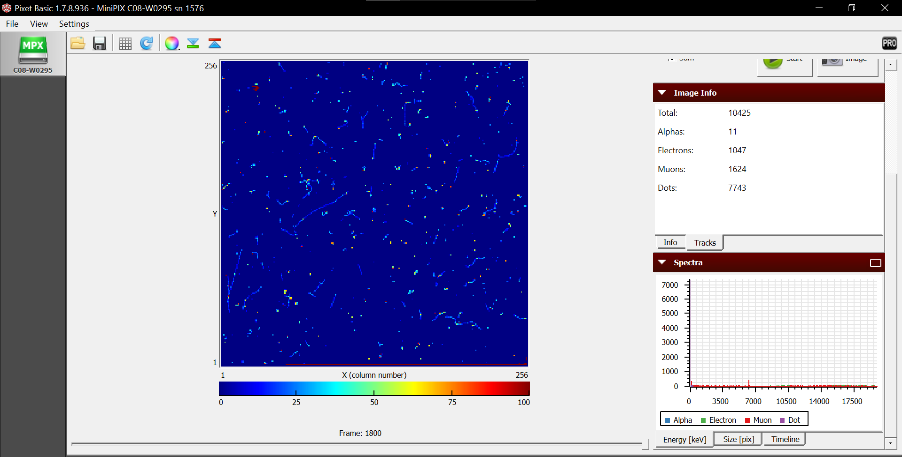
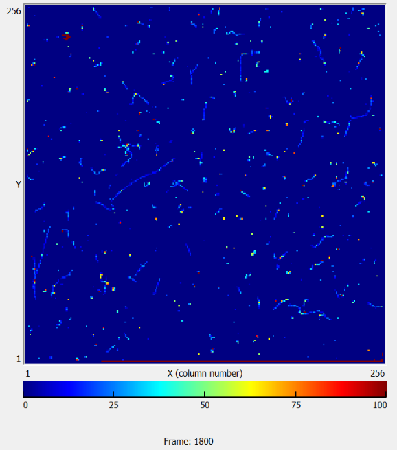
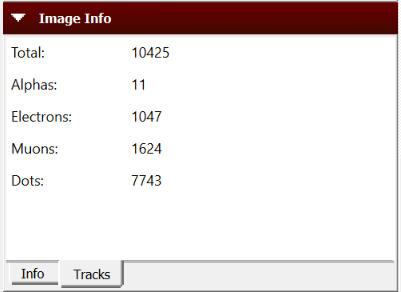

# Particle tracks classification
## Analysis of the particle tracks detected by a MINIPIX detector, classified and visualized using PIXet Pro software

I have used the computer vision OpenCV module to analyze these videotracks and create an automated image track classifier

PIXet Pro software is utilized for the analysis of data from the MiniPIX detector. In this image, you can observe the screen where particle tracks are visualized, along with the classification performed by the software using an algorithm based on their position and energy

In the following figure, you can observe the particle detection by the detector. The trajectories accumulate on the screen as they arrive

For example, as you can see, here we have a total of 1800 frames, with one second of detection each. In other words, each frame contains measurements observed by the detector over one second. So, the video of this measurement with 1800 frames has a duration of 1800 seconds (30 minutes).

Furthermore, as new trajectories appear, they are classified into alpha particles, electrons, or muons using the previously mentioned algorithm.

Here, you can observe how, out of the total number of frames, the all observed trajectories (total number of 10425 ) are classified into 11 alphas, 1047 electrons, 1624 muons
and 7743 (particles that have not been classified).

It's important to mention that the software has a small issue when it comes to representing this data. There are some instances in the measurements where the software systematically adds a certain number of particles at regular intervals. It's impossible for a 30-minute detection with a detector of those dimensions to observe 1624 muons. This is because it adds the value periodically even if nothing has been observed

# OBJECTIVE
This is why the use of this software is crucial, aiming to be able to:
## individualize each detected track in a frame, and assign it the corresponding classified particle type
