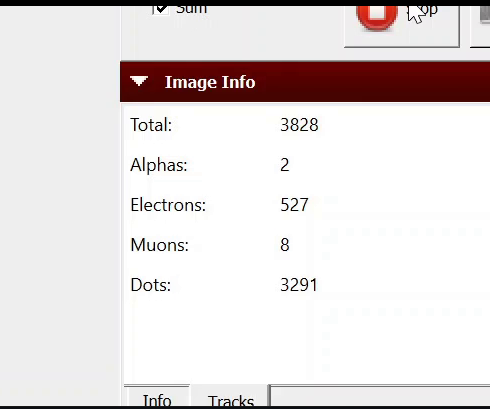

# USERGUIDE

### This file provides a guide on how the program works and the parameters that the user can access

```python
import matplotlib
matplotlib.use('Agg')
import cv2
import imutils
import numpy as np
from PIL import Image
import pytesseract as tess
import re
import copy
```

```python
video_path = 'video1.mkv' #videoroute

#create a object videocapture to open the video
cap = cv2.VideoCapture(video_path)

#check if the video is opened correctly
if not cap.isOpened():
    print("error opening the video.")
else:
    #obtain the amount of fps (frames per second) and the duration in seconds
    fps = int(cap.get(cv2.CAP_PROP_FPS))
    total_frames = int(cap.get(cv2.CAP_PROP_FRAME_COUNT))
    duration_seconds = total_frames / fps

    #  convert the duration into minutes and seconds
    duration_minutes = int(duration_seconds // 60)
    duration_seconds %= 60
    total_frames_seconds=round(total_frames/fps)
    print(f'Duración of the video: {duration_minutes} minutos {duration_seconds} segundos')
    print(f'Total frames = Total segundos = {total_frames_seconds}')
```

Once you have the characteristics of the video you must insert some inputs in order to make easier the analysis.
Here you can specify how much frames do you want to analyze in each segment fragmented of the video.
For example, if my video is 1 min and 19 s long, and i have 79 frames collected
I would like to have 4 arrays in a list of 20 frames stored in each one.

```python
duracion_segmento = int(input("Input the amount of frame sin each segment: "))
total_segmentos=round(total_frames_seconds/duracion_segmento)
print('There are', total_segmentos, 'total segments with this duration',duracion_segmento)
```

Now, we store the frames according to the parameters we have instructed the program to follow

```python
# register of the initial time
inicio_tiempo = time.time()

# open the video
cap = cv2.VideoCapture(video_path)

# check if the video is opened correctly
if not cap.isOpened():
    print("Error al abrir el video.")
else:
    frames = []
    frame_rate = int(cap.get(cv2.CAP_PROP_FPS))
    
    while True:
        ret, frame = cap.read()
        if not ret:
            break

        # add the frame to the array
        frames.append(frame)

        # go to the next second
        for _ in range(frame_rate - 1):
            cap.read()

    # close the video
    cap.release()
    # Ahora 'frames' contiene un muestreo de fotogramas del video
    print(f' {len(frames)} frames have been stored in the array.')

# close windows opened by opencv
cv2.destroyAllWindows()
fin_tiempo = time.time()

# calculate the time in seconds
tiempo_transcurrido = fin_tiempo - inicio_tiempo

print(f"The code took {tiempo_transcurrido} second to execute.")

# close windows opened by OpenCV
cv2.destroyAllWindows()
im_list=frames #here we have the arrays of frames
intervalo=duracion_segmento
im_list_2=[] # and here we have the list of arrays of frames we want to analyze later
for i in range(0,len(im_list), intervalo):
    sublista=im_list[i:i+intervalo]
    im_list_2.append(sublista)
```

This way, we have all the video frames (79) stored in a list of arrays. Within each array, 20 video frames are stored. 
This allows us to store them efficiently, in an organized manner, and use loops for subsequent analysis


In this section, the video is opened, and the frames are processed one by one, which can take some time. 
For instance, if the video has a duration of 30 minutes, it took 15 minutes to execute

### Now, what we need to do is analyze these stored frames following the main idea explained in the readme

First, I explain how we can analyze in each frame which particles have been detected by the algorithm in the software. 
Within the frame, we focus on the corresponding part of this text
```python
x1, y1, x2, y2 = 1270, 410, 1760,810 
img1=im_list[0][y1:y2, x1:x2] #analyze one frame at these pixels
img1_dots=img1[160:190,170:220] #plot this image
```



Once we have a zoom of this part of the image, we can analyze this text using computer vision modules and text analysis

```python
tess.pytesseract.tesseract_cmd=r'C:\Program Files\Tesseract-OCR\tesseract.exe'
```

The line of code `tess.pytesseract.tesseract_cmd = r'C:\Program Files\Tesseract-OCR\tesseract.exe'` is used to configure the location of the Tesseract OCR executable on your system. It allows the pytesseract library to know where to find the Tesseract OCR program for optical character recognition (OCR).

Here's a more detailed explanation of what this line of code does:

`tess.pytesseract: pytesseract` is a Python library that provides an interface for using Tesseract OCR in Python. This library is used for performing OCR tasks, such as extracting text from images or scans."


With this `textpattern` function, we will be able to check if the module finds a certain text pattern in this zoomed image of the frame. 
For example, we will be able to recognize the text pattern 'electrons:' and, consequently, the number that appears to its right, '527'
```python
def textpattern(pattern,text, particle):
# We use a regular expression to search for the number following 'Electrons:'
    # we search the pattern in the text
    match = re.search(pattern, text)
    # verify if the module has found the number and we obtain it
    if match:
        numero = int(match.group(1))
        # print("Número de ",particle,":", numero)
        return numero
    else:
        print("Número de ",particle," no encontrado.")
```


It's possible that the program may not be able to recognize the text, which is controlled with the 'print' statement in the 'else' block

With the following function, we will obtain the number of electrons, muons, alphas, and the total indicated in the frame. 
This function `n_particle()` calls the previous `textpattern()` function, to which the corresponding text pattern we want to search for is applied 
(for example, `pattern_e = r"Electrons:\s*(\d+)"` for electrons).

```python
def n_particles(image):
    x1, y1, x2, y2 = 1270, 410, 1760,810 
    img1=image[y1:y2, x1:x2]
    text=tess.image_to_string(img1)
    pattern_e = r"Electrons:\s*(\d+)"
    pattern_muons = r"Muons:\s*(\d+)"
    pattern_alphas = r"Alphas:\s*(\d+)"
    pattern_total= r"Total:\s*(\d+)"
    n_total=textpattern(pattern_total,text,  'total')
    n_alphas=textpattern(pattern_alphas,text, 'alphas')
    n_e=textpattern(pattern_e,text, 'electrones')
    n_muons=textpattern(pattern_muons,text, 'muons')
    
    return n_total, n_alphas, n_e, n_muons
```
